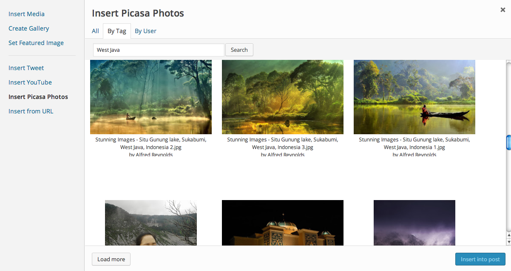

<!-- DO NOT EDIT THIS FILE; it is auto-generated from readme.txt -->
# MEXP Picasa

Picasa extension for the Media Explorer.

**Contributors:** [akeda](http://profiles.wordpress.org/akeda)  
**Tags:** [media explorer](http://wordpress.org/plugins/tags/media explorer), [mexp](http://wordpress.org/plugins/tags/mexp), [picasa](http://wordpress.org/plugins/tags/picasa), [media](http://wordpress.org/plugins/tags/media)  
**Requires at least:** 3.6  
**Tested up to:** 3.8  
**Stable tag:** trunk (master)  
**License:** [GPLv2 or later](http://www.gnu.org/licenses/gpl-2.0.html)  

## Description ##

This plugin is an extension for [Media Exporer](https://github.com/Automattic/media-explorer/) plugin that adds Picasa service.
This extension allows user to search photos from Picasa by text, tag and user ID.

Please note that currently Picasa oEmbed is not supported by default, so you need to implement Picasa oEmbed implementation.

**Development of this plugin is done [on GitHub](https://github.com/gedex/mexp-picasa). Pull requests welcome.**

## Installation ##

Upload MEXP Picasa plugin to your blog's `wp-content/plugins/` directory and activate.

## Screenshots ##

### Search photos from Picasa within media explorer

## Changelog ##

### 0.1.0 ###
Initial release

